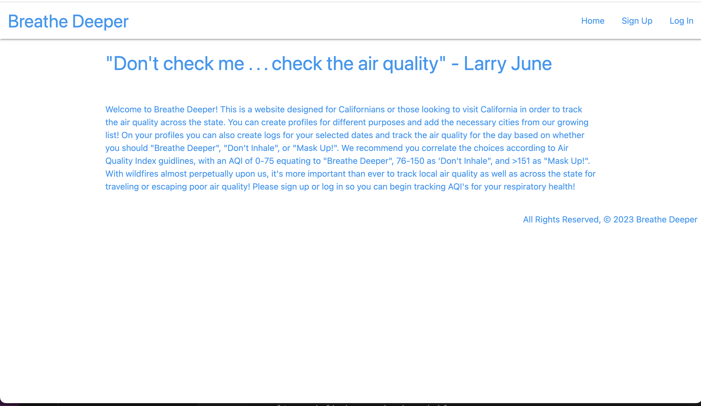
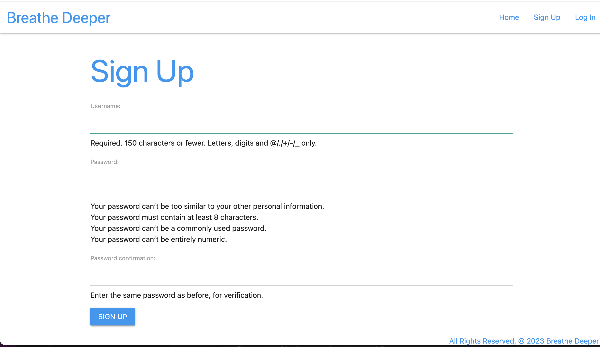
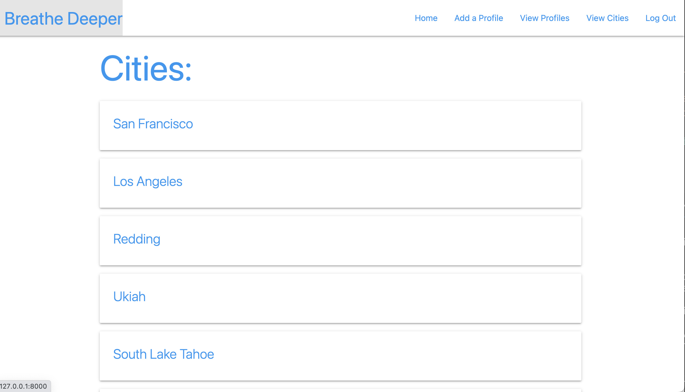
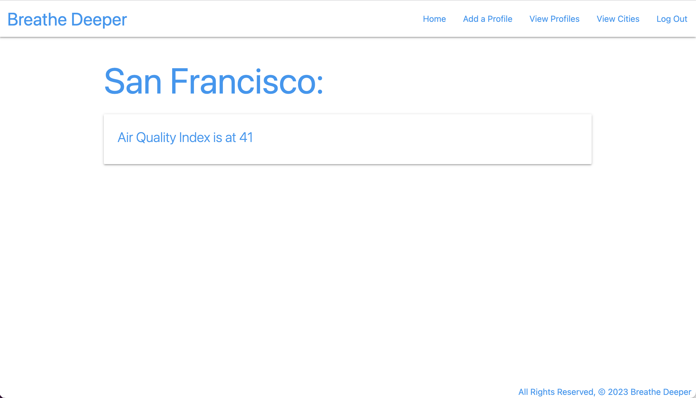
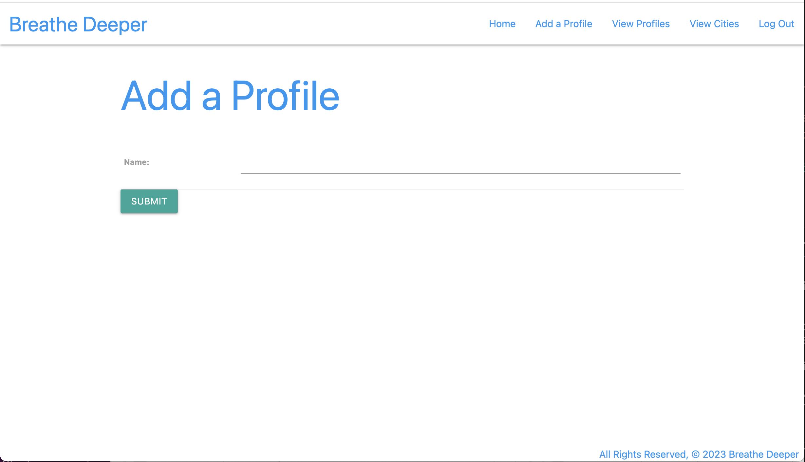
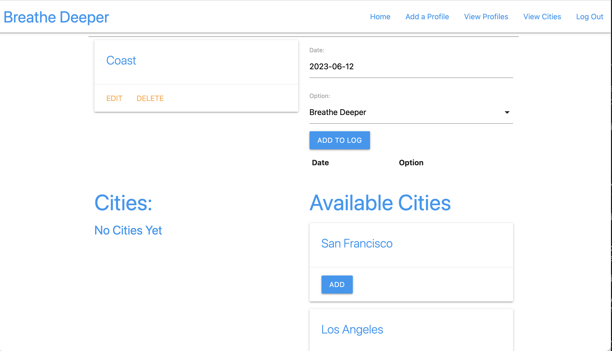
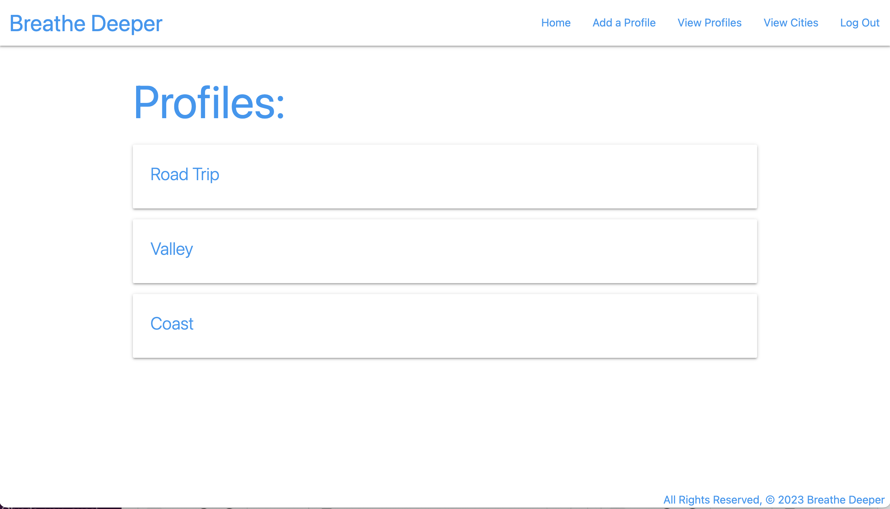

# Breathe Deeper

Welcome to Breathe Deeper! This is a website designed for Californians or those looking to visit California in order to track the air quality across the state. You can create profiles for different purposes and add the necessary cities from our growing list! On your profiles you can also create logs for your selected dates and track the air quality for the day based on whether you should "Breathe Deeper", "Don't Inhale", or "Mask Up!". We recommend you correlate the choices according to Air Quality Index guidlines, with an AQI of 0-75 equating to "Breathe Deeper", 76-150 as 'Don't Inhale", and >151 as "Mask Up!". With wildfires almost perpetually upon us, it's more important than ever to track local air quality as well as across the state for traveling or escaping poor air quality! Please sign up or log in so you can begin tracking AQI's for your respiratory health!

## Technologies Used
This App was created using:
-Python  
-Django  
-HTML  
-CSS  
-Javascript  
-Materialize CSS Library  
-Open-Meteo Air Quality API  
-Heroku  

## Getting Started
https://breathe-deeper.herokuapp.com/  
Click the link to navigate to the homepage and get the rundown!

Head to the Sign Up page to become an authorized user!

Once you're signed up you will be redirected to the list of cities:

From there you can click on a city to view it's latest AQI!

After you've checked out some air qualities, create some profiles to add cities to!

Once you've created a new profile you will be redirected to that profile's detail page where you can cities to the profile as well as create logs for the air quality by date:

If you'd like to switch between profiles simply navigate to the View Profiles page where you can view your full list specific to you as a user

Don't forget to log out of your session once you're done!

## What's Next?
Some features I would like to include in the future are a search feature which will open the api up globally, include a guide on which log option to choose on the city detail page, as well as a more dynamic design which would render the city details green, yellow, or red, corresponding to the levels of AQI a good, moderate, or hazardous. 